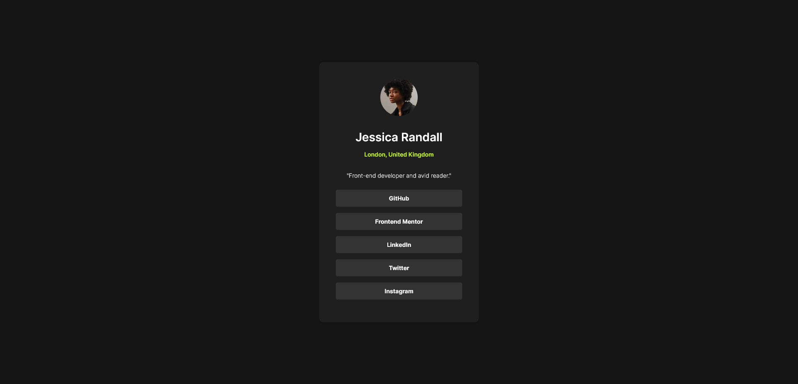

# Frontend Mentor - Social links profile solution

This is a solution to the [Social links profile challenge on Frontend Mentor](https://www.frontendmentor.io/challenges/social-links-profile-UG32l9m6dQ). Frontend Mentor challenges help you improve your coding skills by building realistic projects. 

## Table of contents

- [Overview](#overview)
  - [The challenge](#the-challenge)
  - [Screenshot](#screenshot)
  - [Links](#links)
- [My process](#my-process)
  - [Built with](#built-with)
  - [What I learned](#what-i-learned)
  - [Continued development](#continued-development)
  - [Useful resources](#useful-resources)
- [Author](#author)
- [Acknowledgments](#acknowledgments)

## Overview

### The challenge

Users should be able to:

- See hover and focus states for all interactive elements on the page

### Screenshot



### Links

- Solution URL: [github](https://github.com/laurentGurbala/Social-links-profile)
- Live Site URL: [gitpage](https://laurentgurbala.github.io/Social-links-profile/)

## My process

### Built with

- Semantic HTML5 markup
- CSS custom properties
- Flexbox
- Mobile-first workflow

### What I learned

During this project, I learned to adopt a **mobile-first** approach to styling and how to manage responsiveness using **media queries** instead of relying on CSS functions like `clamp()`. This allowed for a more controlled layout transition between mobile and desktop. I also focused on **hover states** for interactive elements, ensuring a good user experience across devices.

Here’s an example of the media query I used for larger screens:

```css
@media (min-width: 768px) {
    .card-profile { 
        max-width: 384px;
        padding: var(--pad-desktop);
    }
}
```

## Author

- Website - [laurent gurbala](https://github.com/laurentGurbala)
- Frontend Mentor - [@laurent gurbala](https://www.frontendmentor.io/profile/laurentGurbala)
- X - [@laurent gurbala](https://x.com/GurbalaLaurent)
